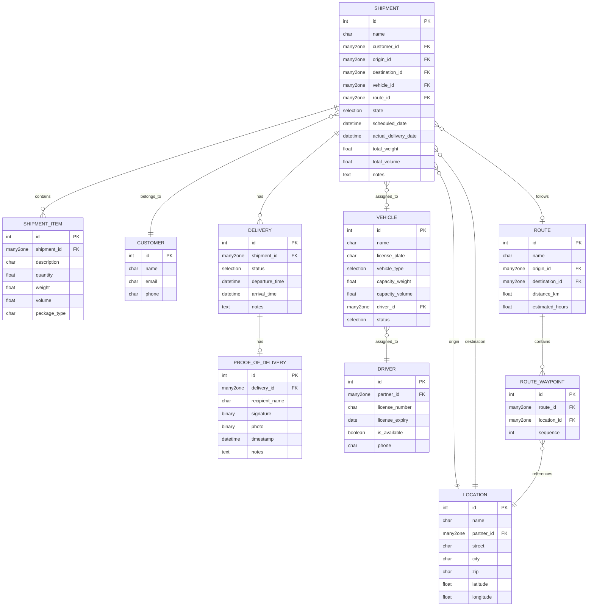
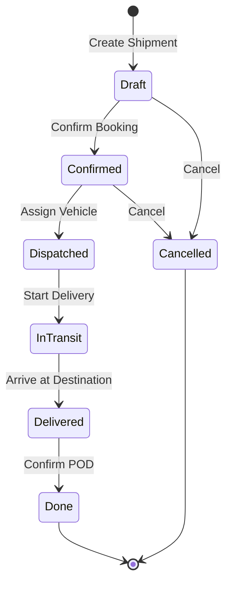
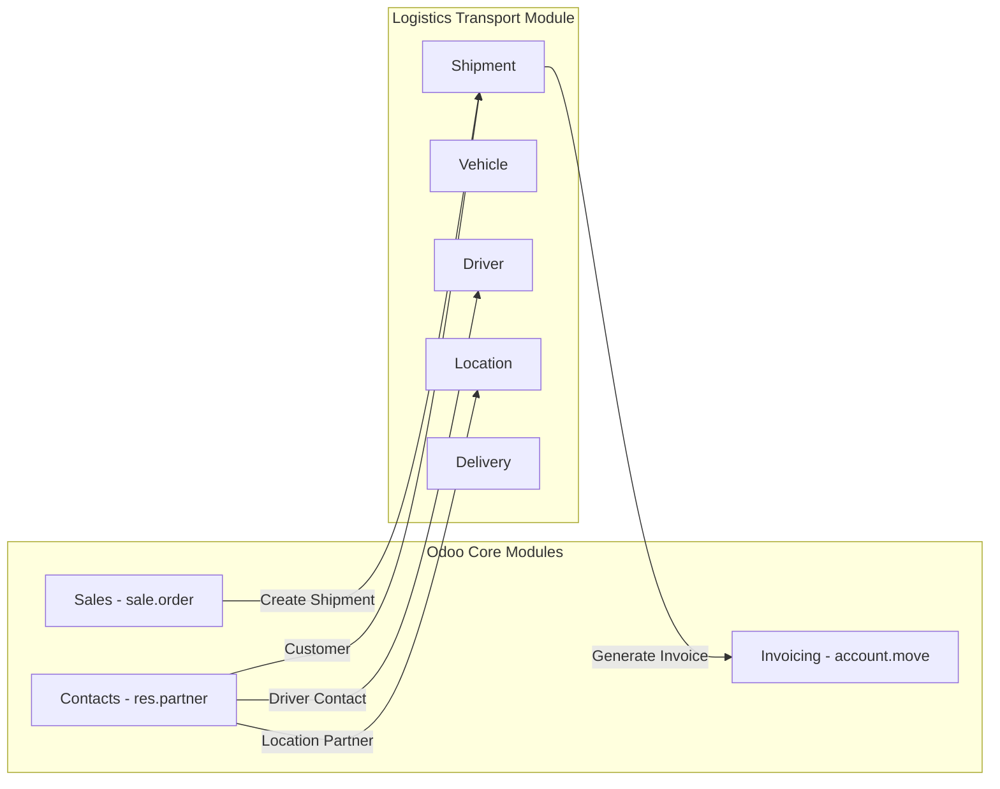

# Logistics Transport Module - Architecture Plan

## Overview

A comprehensive freight/cargo transportation management module for Odoo 17.0.

### Requirements Summary

| Aspect | Details |
|--------|---------|
| **Business Type** | Freight/Cargo Transportation |
| **Scale** | Small-Medium (10-50 shipments/day) |
| **Odoo Version** | 17.0 |
| **Integrations** | Sales, Invoicing, Contacts |
| **Core Features** | Shipment booking, Route planning, Vehicle assignment, Delivery tracking, Proof of delivery |

---

## 1. Module Structure

```
custom_addons/
└── logistics_transport/
    ├── __init__.py
    ├── __manifest__.py
    ├── models/
    │   ├── __init__.py
    │   ├── vehicle.py
    │   ├── driver.py
    │   ├── location.py
    │   ├── route.py
    │   ├── shipment.py
    │   ├── shipment_item.py
    │   ├── delivery.py
    │   └── proof_of_delivery.py
    ├── views/
    │   ├── vehicle_views.xml
    │   ├── driver_views.xml
    │   ├── location_views.xml
    │   ├── route_views.xml
    │   ├── shipment_views.xml
    │   ├── delivery_views.xml
    │   └── menu_views.xml
    ├── security/
    │   ├── ir.model.access.csv
    │   └── security_groups.xml
    ├── data/
    │   ├── sequence_data.xml
    │   └── shipment_stages.xml
    ├── reports/
    │   ├── waybill_report.xml
    │   └── delivery_report.xml
    ├── wizard/
    │   └── assign_vehicle_wizard.py
    └── static/
        └── description/
            └── icon.png
```

---

## 2. Core Data Models

### Entity Relationship Diagram



---

## 3. Shipment Workflow



### Shipment States

| State | Description | Actions Available |
|-------|-------------|-------------------|
| **Draft** | Initial state, booking created | Edit, Confirm, Cancel |
| **Confirmed** | Booking confirmed, awaiting dispatch | Assign Vehicle, Cancel |
| **Dispatched** | Vehicle assigned, ready for pickup | Start Delivery |
| **In Transit** | Cargo in transit | Update Location, Mark Delivered |
| **Delivered** | Arrived at destination | Capture POD |
| **Done** | POD confirmed, shipment complete | Generate Invoice |
| **Cancelled** | Shipment cancelled | - |

---

## 4. Detailed Model Specifications

### 4.1 Shipment Model - `logistics.shipment`

| Field | Type | Description |
|-------|------|-------------|
| `name` | Char | Auto-generated sequence (SHP/0001) |
| `customer_id` | Many2one → res.partner | Customer who booked |
| `origin_id` | Many2one → logistics.location | Pickup location |
| `destination_id` | Many2one → logistics.location | Delivery location |
| `vehicle_id` | Many2one → logistics.vehicle | Assigned vehicle |
| `driver_id` | Related → vehicle.driver_id | Assigned driver |
| `route_id` | Many2one → logistics.route | Planned route |
| `state` | Selection | draft/confirmed/dispatched/in_transit/delivered/done/cancelled |
| `scheduled_pickup` | Datetime | Planned pickup time |
| `scheduled_delivery` | Datetime | Expected delivery time |
| `actual_pickup` | Datetime | Real pickup time |
| `actual_delivery` | Datetime | Real delivery time |
| `total_weight` | Float | Computed from items |
| `total_volume` | Float | Computed from items |
| `sale_order_id` | Many2one → sale.order | Linked sales order |
| `invoice_ids` | One2many → account.move | Generated invoices |
| `item_ids` | One2many → logistics.shipment.item | Shipment items |
| `delivery_ids` | One2many → logistics.delivery | Delivery records |
| `notes` | Text | Additional notes |

### 4.2 Shipment Item Model - `logistics.shipment.item`

| Field | Type | Description |
|-------|------|-------------|
| `shipment_id` | Many2one → logistics.shipment | Parent shipment |
| `description` | Char | Item description |
| `quantity` | Float | Number of units |
| `weight` | Float | Weight in kg |
| `volume` | Float | Volume in m3 |
| `package_type` | Selection | box/pallet/container/other |

### 4.3 Vehicle Model - `logistics.vehicle`

| Field | Type | Description |
|-------|------|-------------|
| `name` | Char | Vehicle name/identifier |
| `license_plate` | Char | Registration number |
| `vehicle_type` | Selection | truck/van/trailer/container |
| `capacity_weight` | Float | Max weight in kg |
| `capacity_volume` | Float | Max volume in m3 |
| `driver_id` | Many2one → logistics.driver | Default driver |
| `status` | Selection | available/in_use/maintenance |
| `current_shipment_id` | Many2one → logistics.shipment | Currently assigned shipment |

### 4.4 Driver Model - `logistics.driver`

| Field | Type | Description |
|-------|------|-------------|
| `partner_id` | Many2one → res.partner | Contact record |
| `name` | Related | Driver name |
| `license_number` | Char | Driving license |
| `license_expiry` | Date | License validity |
| `phone` | Char | Contact phone |
| `is_available` | Boolean | Availability status |
| `current_vehicle_id` | Many2one → logistics.vehicle | Currently assigned vehicle |

### 4.5 Location Model - `logistics.location`

| Field | Type | Description |
|-------|------|-------------|
| `name` | Char | Location name |
| `partner_id` | Many2one → res.partner | Related partner |
| `street` | Char | Street address |
| `street2` | Char | Street address line 2 |
| `city` | Char | City |
| `state_id` | Many2one → res.country.state | State/Province |
| `country_id` | Many2one → res.country | Country |
| `zip` | Char | ZIP/Postal code |
| `latitude` | Float | GPS latitude |
| `longitude` | Float | GPS longitude |
| `location_type` | Selection | warehouse/customer/port/other |

### 4.6 Route Model - `logistics.route`

| Field | Type | Description |
|-------|------|-------------|
| `name` | Char | Route name |
| `origin_id` | Many2one → logistics.location | Start point |
| `destination_id` | Many2one → logistics.location | End point |
| `waypoint_ids` | One2many → logistics.route.waypoint | Route waypoints |
| `distance_km` | Float | Total distance in km |
| `estimated_hours` | Float | Estimated travel time |
| `active` | Boolean | Is route active |

### 4.7 Route Waypoint Model - `logistics.route.waypoint`

| Field | Type | Description |
|-------|------|-------------|
| `route_id` | Many2one → logistics.route | Parent route |
| `location_id` | Many2one → logistics.location | Waypoint location |
| `sequence` | Integer | Order in route |

### 4.8 Delivery Model - `logistics.delivery`

| Field | Type | Description |
|-------|------|-------------|
| `shipment_id` | Many2one → logistics.shipment | Parent shipment |
| `status` | Selection | pending/departed/in_transit/arrived/delivered |
| `departure_time` | Datetime | When vehicle departed |
| `arrival_time` | Datetime | When vehicle arrived |
| `pod_id` | Many2one → logistics.proof.of.delivery | Proof of delivery |
| `notes` | Text | Delivery notes |

### 4.9 Proof of Delivery Model - `logistics.proof.of.delivery`

| Field | Type | Description |
|-------|------|-------------|
| `delivery_id` | Many2one → logistics.delivery | Parent delivery |
| `recipient_name` | Char | Who received the cargo |
| `signature` | Binary | Digital signature |
| `photo` | Binary | Photo of delivered goods |
| `timestamp` | Datetime | When POD was captured |
| `notes` | Text | Additional notes |
| `latitude` | Float | GPS latitude at delivery |
| `longitude` | Float | GPS longitude at delivery |

---

## 5. Odoo Module Integrations



### Integration Details

#### 5.1 Contacts Integration (res.partner)

- Customers are linked to shipments via `customer_id`
- Drivers extend partner records via `partner_id`
- Locations can reference partner addresses

#### 5.2 Sales Integration (sale.order)

- Add a smart button on sales order to create shipment
- Auto-populate customer and delivery address from sales order
- Link shipment back to sales order via `sale_order_id`
- Track shipment status from sales order view

#### 5.3 Invoicing Integration (account.move)

- Generate invoice from completed shipment
- Include shipment details in invoice lines
- Track payment status on shipment
- Support for partial invoicing

---

## 6. User Roles and Access Control

### Security Groups

| Role | Technical Name | Description |
|------|----------------|-------------|
| **Logistics User** | `group_logistics_user` | Basic operations - Read all, Create/Edit own shipments |
| **Dispatcher** | `group_logistics_dispatcher` | Manage all shipments - Full CRUD on shipments, vehicles, routes |
| **Driver** | `group_logistics_driver` | Mobile access - Read assigned shipments, Update delivery status |
| **Manager** | `group_logistics_manager` | Full control - All access + configuration + reports |

### Security Groups Hierarchy

```
logistics_transport.group_logistics_user
    └── logistics_transport.group_logistics_dispatcher
        └── logistics_transport.group_logistics_manager

logistics_transport.group_logistics_driver (separate branch)
```

### Access Rights Matrix

| Model | User | Dispatcher | Driver | Manager |
|-------|------|------------|--------|---------|
| logistics.shipment | CRUD own | CRUD all | Read assigned | CRUD all |
| logistics.shipment.item | CRUD own | CRUD all | Read | CRUD all |
| logistics.vehicle | Read | CRUD | Read assigned | CRUD all |
| logistics.driver | Read | CRUD | Read own | CRUD all |
| logistics.location | Read | CRUD | Read | CRUD all |
| logistics.route | Read | CRUD | Read | CRUD all |
| logistics.delivery | Read | CRUD | CRUD assigned | CRUD all |
| logistics.proof.of.delivery | Read | CRUD | CRUD assigned | CRUD all |

---

## 7. UI/UX Design

### 7.1 Menu Structure

```
Logistics
├── Operations
│   ├── Shipments
│   ├── Deliveries
│   └── Proof of Delivery
├── Planning
│   ├── Routes
│   └── Vehicle Assignment
├── Fleet
│   ├── Vehicles
│   └── Drivers
├── Configuration
│   ├── Locations
│   └── Settings
└── Reports
    ├── Shipment Analysis
    └── Delivery Performance
```

### 7.2 View Types

#### Shipment Views

- **Kanban View:** Drag-and-drop between states (Draft → Confirmed → Dispatched → etc.)
- **List View:** Quick overview with filters by state/date/customer
- **Form View:** Full details with smart buttons (Assign Vehicle, Start Delivery, Generate Invoice)
- **Calendar View:** Scheduled pickups/deliveries by date

#### Vehicle Views

- **Kanban View:** Visual status cards (Available/In Use/Maintenance)
- **List View:** Fleet overview with capacity and status
- **Form View:** Vehicle details with current assignment

#### Dashboard

Key metrics to display:
- Shipments by state
- Today's deliveries
- Vehicle availability
- On-time delivery rate

---

## 8. Implementation Roadmap

### Phase 1: Foundation

**Tasks:**
- [ ] Create module scaffold with `__manifest__.py`
- [ ] Implement `logistics.vehicle` model
- [ ] Implement `logistics.driver` model
- [ ] Implement `logistics.location` model
- [ ] Implement `logistics.route` and `logistics.route.waypoint` models
- [ ] Create basic views for all Phase 1 models
- [ ] Create menu structure

### Phase 2: Core Features

**Tasks:**
- [ ] Implement `logistics.shipment` model with workflow
- [ ] Implement `logistics.shipment.item` model
- [ ] Create shipment views (form, list, kanban, calendar)
- [ ] Implement vehicle assignment wizard
- [ ] Add computed fields for weight/volume totals
- [ ] Add sequence for shipment numbering

### Phase 3: Delivery Tracking

**Tasks:**
- [ ] Implement `logistics.delivery` model
- [ ] Implement `logistics.proof.of.delivery` model
- [ ] Create delivery tracking views
- [ ] Add status update buttons and workflow
- [ ] Implement POD capture functionality

### Phase 4: Integrations

**Tasks:**
- [ ] Add smart button on sale.order for shipment creation
- [ ] Implement shipment creation from sales order
- [ ] Implement invoice generation from shipment
- [ ] Link shipment to sales and invoicing modules

### Phase 5: Polish and Reports

**Tasks:**
- [ ] Create waybill report template
- [ ] Create delivery report template
- [ ] Configure security groups and access rights
- [ ] Set up access rights CSV
- [ ] Create dashboard with key metrics
- [ ] Testing and bug fixes

---

## 9. Technical Considerations

### Dependencies

```python
'depends': ['base', 'sale', 'account', 'contacts'],
```

### Sequences

- Shipment: `SHP/%(year)s/%(month)s/0001`
- Delivery: `DEL/%(year)s/%(month)s/0001`

### Computed Fields

- `total_weight`: Sum of all shipment items weight
- `total_volume`: Sum of all shipment items volume
- `is_overweight`: Compare total weight vs vehicle capacity
- `delivery_status`: Latest delivery record status

### Automation

- Auto-update shipment state when delivery status changes
- Auto-mark vehicle as "in_use" when assigned to shipment
- Send notification when shipment state changes

---

## 10. Future Enhancements

Potential features for future versions:

1. **Pricing Module:** Dynamic pricing based on weight/distance/volume
2. **Customer Portal:** Self-service tracking for customers
3. **Mobile App:** Driver mobile application
4. **GPS Tracking:** Real-time vehicle tracking
5. **Documents:** Waybills, bills of lading, customs documents
6. **Analytics:** Advanced reporting and BI dashboards
7. **Multi-company:** Support for multiple branches/companies
